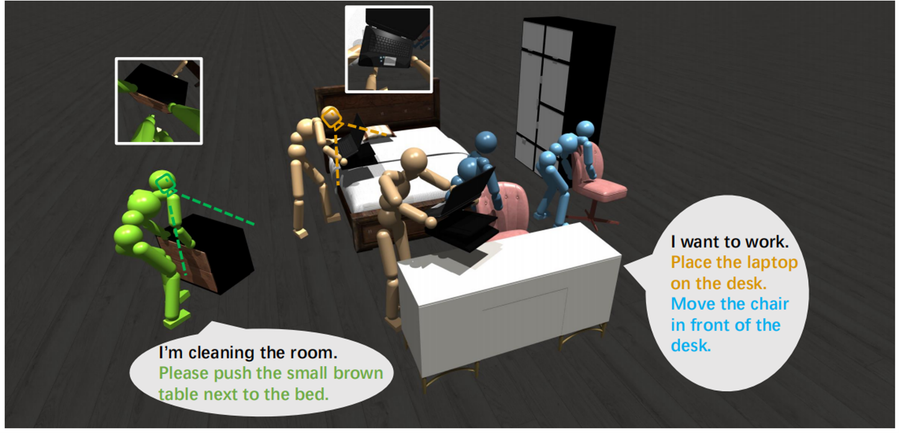

Now, I'm a first year mphil student from [Robotics and Autonomous Systems](https://www.hkust-gz.edu.cn/academics/hubs-and-thrust-areas/systems-hub/robotics-and-autonomous-systems/), [HKUST-GZ](https://www.hkust-gz.edu.cn/). My research interest includes computer vision, computer graphics, reinforcement learning, human scene interaction.

Now I'm working with RBM project"Interactive 3D AIGC for User-Centric Game/Film Production". This project aims to revolutionize the creation of 3D digital content by developing an AI-driven platform that streamlines and automates the generation and editing of 3D assets. The platform is designed to cater to the film and gaming industries, where 3D assets such as scenes, objects, and digital humans are crucial. By integrating advanced generative AI models with interactive tools, the project seeks to reduce the technical barriers and time-consuming processes traditionally associated with 3D modeling, thereby enhancing workflow efficiency and enabling creators to produce high-quality 3D content more rapidly and cost-effectively.

My project, "Long-Horizon Human Scene Interactions Driven by Vision-Language Model," complements the group effort by focusing on the dynamic aspect of virtual world creation—human animation. This project addresses the challenge of generating realistic, detailed, and coherent human movements from natural language descriptions. It leverages a multi-modal agent architecture to achieve fine-grained control over complex actions, ensuring each motion aligns with user expectations. The generated animations will interact seamlessly with the static components of the virtual world created by other team members, thus enriching the overall immersive experience.

You can find my CV [here](../assets/CXuanchao Peng - CV.docx).

[Email](pengxuanchao@outlook.com) / [Github](https://github.com/xuanchaopeng)
